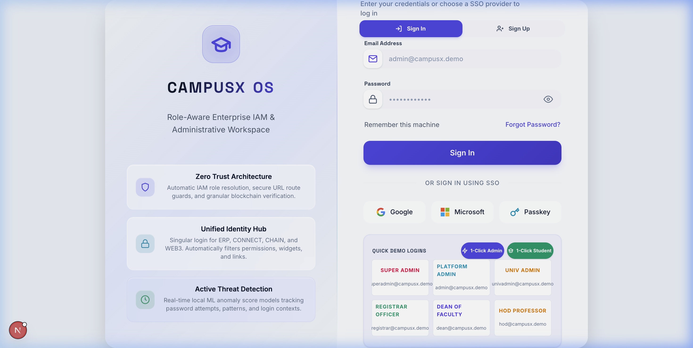
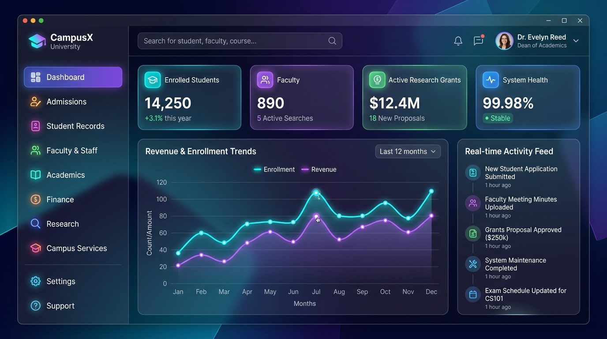
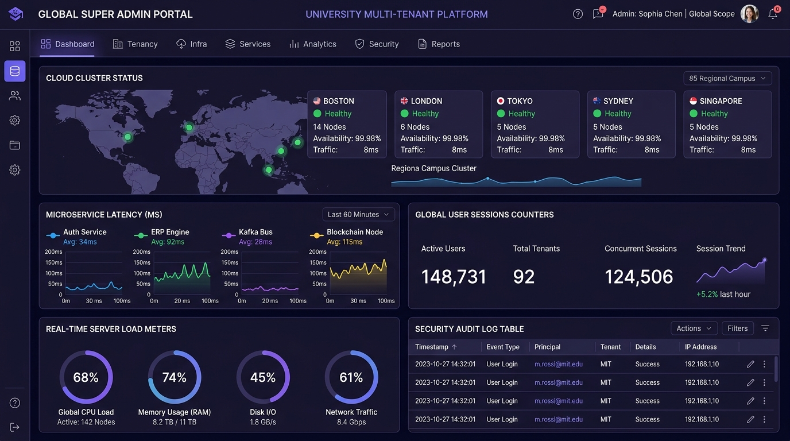
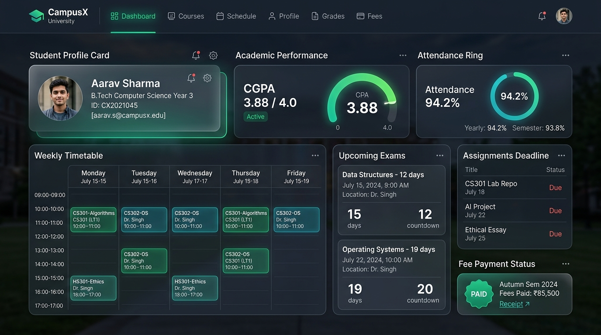
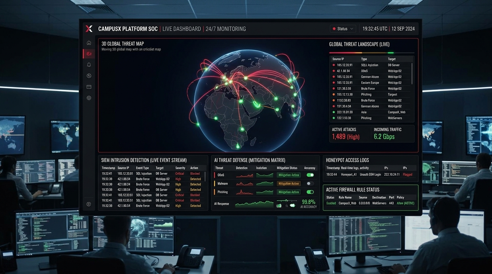
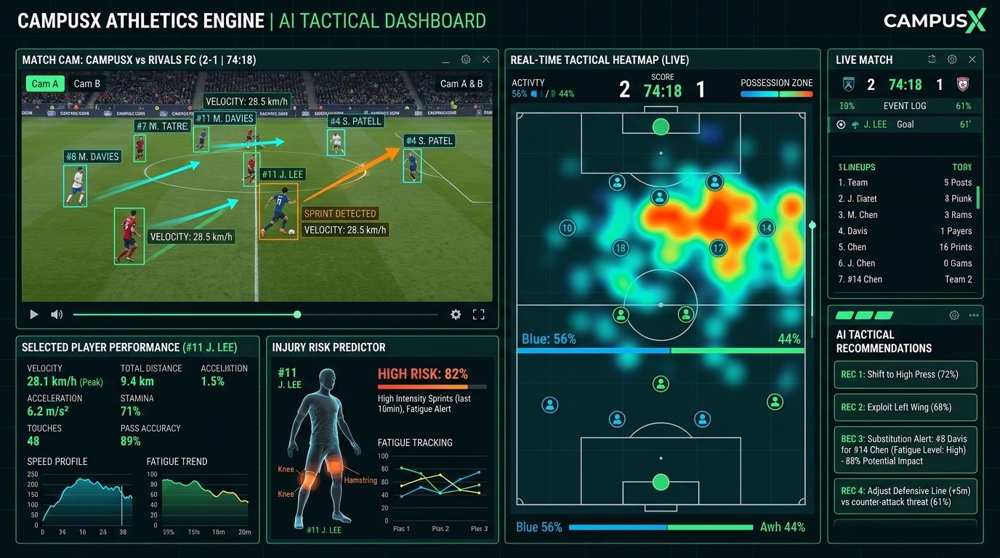
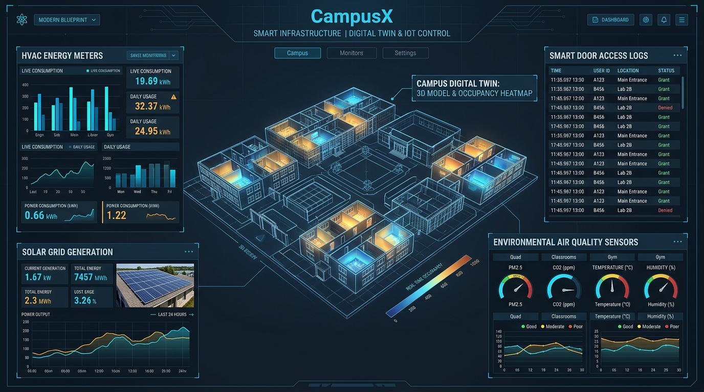
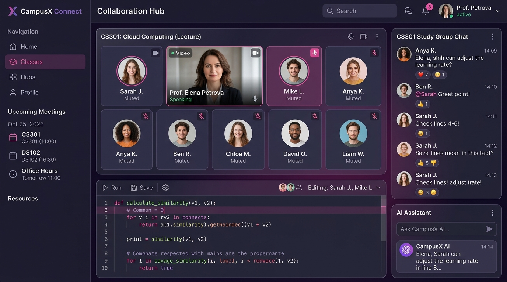
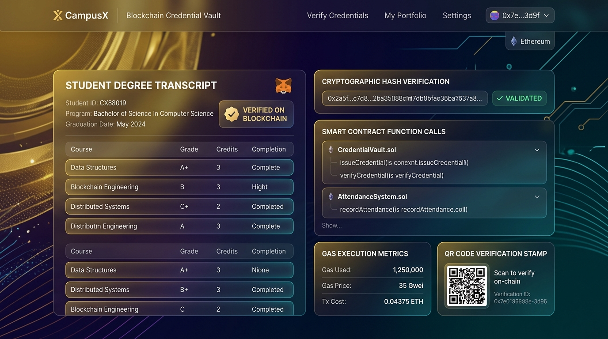
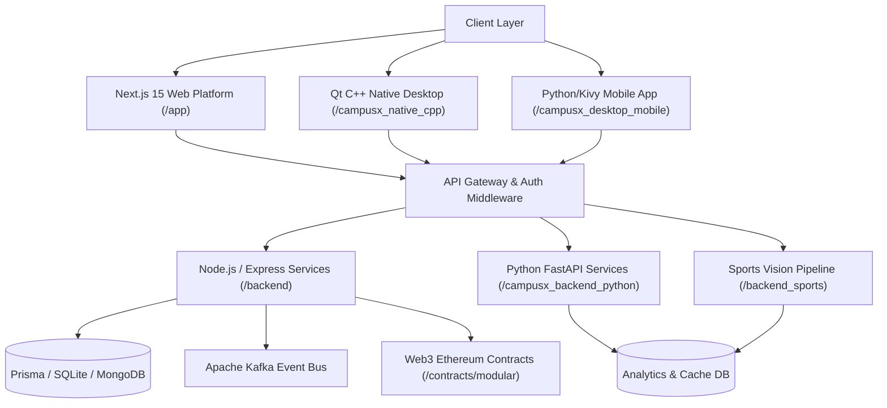

# 🎓 CampusX OS — Next-Generation University ERP & Autonomous Campus Operating System

[](https://github.com/tauhidalamx/campusXos_erp)
[](https://nextjs.org/)
[](https://fastapi.tiangolo.com/)
[](https://soliditylang.org/)
[](https://qt.io)
[](LICENSE)

> **CampusX OS** is an enterprise-grade, multi-tenant University Enterprise Resource Planning (ERP) platform and Autonomous Campus Operating System. Designed for modern higher education institutions, it combines real-time academic governance, AI-driven sports analytics, 3D Digital Twin IoT building control, Web3 tamper-proof blockchain credentials, and 24/7 Security Operations Center (SOC) cyber threat intelligence.

---

## 📌 Interactive Table of Contents
- [✨ Core Highlights](#-core-highlights)
- [🖼 Visual Showcase & Screenshots](#-visual-showcase--screenshots)
- [👥 User Roles & Access Matrix](#-user-roles--access-matrix)
- [🏗 System Architecture & Microservices](#-system-architecture--microservices)
- [🚀 Module Deep-Dive](#-module-deep-dive)
- [⚡ Quick Start & Installation](#-quick-start--installation)
- [🔑 Demo Credentials](#-demo-credentials)
- [🛠 CLI Tools & Scripts](#-cli-tools--scripts)
- [📄 License & Credits](#-license--credits)

---

## ✨ Core Highlights

- 🏢 **Multi-Tenant Global Governance**: Distributed architecture supporting global university clusters with fine-grained RBAC.
- 🎓 **Autonomous Academic Lifecycle**: Automated course registration, timetable optimization, exam seat allocation, and transcript generation.
- 🛡 **Security Operations Center (SOC)**: Live SIEM intrusion detection, global 3D threat map, honeypot telemetry, and AI threat defense matrix.
- ⚽ **Computer Vision & Sports Tactical AI**: Split-screen camera field tracking, sprint velocity vectors, injury risk modeling, and real-time heatmaps.
- 🏛 **3D Digital Twin & IoT Control**: Interactive 3D spatial building blueprint with room occupancy heatmaps, solar grid stats, and HVAC energy meters.
- 💬 **CampusX Connect Collaboration**: Embedded HD video/audio conferencing, real-time channels, interactive code snippet editor, and AI assistant sidecar.
- 🔗 **Web3 Blockchain Credential Vault**: Immutable degree transcripts, fee settlement contracts, and attendance verification stored on Ethereum.
- 💻 **Native C++ & Mobile Apps**: Native Qt/CMake C++ desktop application shell alongside Python/Kivy mobile client with Android Buildozer support.

---

## 🖼 Visual Showcase & Screenshots

### 1. Unified Auth & Security Login Gateway
Features 1-Click Admin and 1-Click Student instant login buttons, TensorFlow.js anomaly detection, multi-factor authentication (MFA), and full Cloud Database auto-synchronization.


---

### 2. Executive Master ERP Dashboard
The central command hub for university leadership providing real-time metrics, financial health, enrollment trends, and institutional KPIs.


---

### 3. Global Super Admin Multi-Tenant Console
Monitors global campus clusters across Boston, London, Tokyo, Sydney, and Singapore with microservice latencies, CPU/RAM server loads, and live audit logs.


---

### 4. Student Portal & Academic Hub
A personalized interface for students featuring live GPA dials, circular attendance rings, interactive class timetables, upcoming exam countdowns, and fee clearance badges.


---

### 5. Cybersecurity Operations Center (SOC)
24/7 SIEM monitoring console featuring a 3D global threat map, live intrusion detection event stream, AI threat defense matrix, and firewall policy status.


---

### 6. Computer Vision & Tactical Sports AI
Empowers coaches and sports directors with player bounding-box video tracking, sprint velocity vectors, fatigue prediction, tactical heatmaps, and substitution AI.


---

### 7. Digital Twin 3D Building & IoT Control
Spatial 3D university blueprint tracking live HVAC energy consumption, solar panel power output, smart door access logs, and environmental air quality sensors.


---

### 8. CampusX Connect Collaboration Hub
Real-time communication suite integrating HD video meetings, class discussion channels, live collaborative code editor, and CampusX AI sidecar assistance.


---

### 9. Web3 Blockchain Credential Vault
Verifies academic transcripts and student credentials against Ethereum smart contracts (`CredentialVault.sol`, `AttendanceSystem.sol`) with cryptographic hash validation.


---

## 👥 User Roles & Access Matrix

CampusX OS enforces strict Role-Based Access Control (RBAC) across 18 distinct user personas to ensure data isolation, regulatory compliance, and customized user workflows.

### Role Overview Table

| Role Identifier | User Persona | Primary Responsibilities | Target Landing Page |
| :--- | :--- | :--- | :--- |
| `superadmin` | **Global Super Admin** | Multi-tenant university cluster management, cloud infrastructure, global SOC | [`/admin/global`](file:///Users/tauhidalam/antygravity/app/admin/global/page.js) |
| `platformadmin` | **Platform Administrator** | Microservice health, node topology, database shard maintenance & API gateways | [`/admin/platform`](file:///Users/tauhidalam/antygravity/app/admin/platform/page.js) |
| `admin` | **University Admin** | Executive ERP dashboard, institutional metrics, budget overview & NAAC/NIRF reporting | [`/erp/admin`](file:///Users/tauhidalam/antygravity/app/erp/admin/page.js) |
| `registrar` | **Registrar Officer** | Enrolment verification, academic transcripts, degree verification & regulatory filings | [`/erp/registrar`](file:///Users/tauhidalam/antygravity/app/erp/registrar/page.js) |
| `dean` | **Dean of Faculty** | Academic governance, curriculum approvals, faculty workload & research grants | [`/erp/dean`](file:///Users/tauhidalam/antygravity/app/erp/dean/page.js) |
| `hod` | **Head of Department (HOD)** | Department schedule, course allocation, marks approvals & lab management | [`/erp/hod`](file:///Users/tauhidalam/antygravity/app/erp/hod/page.js) |
| `faculty` | **Faculty / Professor** | Class scheduling, attendance marking, assignment grading & student mentoring | [`/faculty/home`](file:///Users/tauhidalam/antygravity/app/faculty/home/page.js) |
| `student` | **Student** | Course registration, grade cards, attendance tracker, fee payment & library access | [`/student/home`](file:///Users/tauhidalam/antygravity/app/student/home/page.js) |
| `parent` / `sports_parent` | **Parent** | Student academic monitoring, fee dues payment, attendance alerts & health updates | [`/parent/dashboard`](file:///Users/tauhidalam/antygravity/app/parent/dashboard/page.js) |
| `alumni` | **Alumni** | Networking portal, donation management, transcript requests & career mentoring | [`/alumni/home`](file:///Users/tauhidalam/antygravity/app/alumni/home/page.js) |
| `recruiter` | **Lead Recruiter** | Corporate placement portal, candidate shortlisting, interview scheduling & offer releases | [`/recruiter/dashboard`](file:///Users/tauhidalam/antygravity/app/recruiter/dashboard/page.js) |
| `placement_officer` | **Placement Officer** | Drive coordination, company liaison, salary statistics & mock interview tracking | [`/placement/dashboard`](file:///Users/tauhidalam/antygravity/app/placement/dashboard/page.js) |
| `research_coordinator` | **Research Coordinator** | Grant tracking, patent filings, journal publication indices & lab stock portfolios | [`/research/dashboard`](file:///Users/tauhidalam/antygravity/app/research/dashboard/page.js) |
| `finance_manager` | **Finance Manager** | Institutional accounting, tuition fee ledgers, payroll processing & audit logs | [`/finance/dashboard`](file:///Users/tauhidalam/antygravity/app/finance/dashboard/page.js) |
| `sports_director` | **Sports Director** | Athletics management, tournament planning, team selections & tactical AI analytics | [`/sports/director`](file:///Users/tauhidalam/antygravity/app/sports/[[...slug]]/page.js) |
| `coach` | **Athletic Coach** | Player performance metrics, training drills, injury logs & video biomechanics | [`/sports/coach`](file:///Users/tauhidalam/antygravity/app/sports/[[...slug]]/page.js) |
| `athlete` | **Student Athlete** | Personal fitness metrics, event schedules, performance analytics & tactical AI breakdown | [`/sports/athlete`](file:///Users/tauhidalam/antygravity/app/sports/[[...slug]]/page.js) |
| `soc` / `compliance` | **Security Officer** | Real-time threat detection, SIEM log analysis, firewall policy tuning & compliance | [`/soc`](file:///Users/tauhidalam/antygravity/app/soc/page.js) |

---

## 🏗 System Architecture & Microservices

CampusX OS employs a decoupled hybrid microservice and multi-client architecture:



### Stack Components
- **Web App**: Next.js 15, React 19, Framer Motion, Vanilla CSS Design System, Lucide Icons.
- **Node.js Backend**: Express.js 5, TypeScript, KafkaJS, Mongoose, SQLite3, Prisma.
- **Python Backend**: FastAPI, Celery, OpenCV, PyTorch, PySparks, TensorFlow.
- **Blockchain**: Solidity v0.8.20, Hardhat, Ethers.js.
- **Native Desktop**: C++17, Qt 6, CMake Build Automation.
- **Mobile Client**: Python 3.9, Kivy 2.3, Buildozer Android Bootstrap.

---

## 🚀 Module Deep-Dive

### 1. Smart Academic & Examination Engine
- **Exam Seat Allocation**: Automated room and bench placement algorithm avoiding adjacent same-subject seating.
- **Faculty Course Allocation**: Algorithmic course assignment based on faculty domain expertise, workload limits, and student ratings.
- **Mark Approval Workflow**: Multi-tier approvals (Faculty → HOD → Dean → Registrar) before grade card generation.

### 2. Web3 Blockchain Credentialing (`/contracts/modular`)
- **`CredentialVault.sol`**: Issues tamper-proof digital degree certificates on EVM chains.
- **`AttendanceSystem.sol`**: Immutable attendance verification logged per class period.
- **`AcademicCreditContract.sol`**: Decentralized course credit bank enabling inter-university credit transfers.

### 3. Cyber Threat Intelligence & SOC (`/app/soc`)
- **Global SIEM Stream**: Real-time IP geolocation, threat severity classification, and attack vector visualization.
- **Honeypot Network**: Traps unauthorized SSH/HTTP intrusion attempts and records adversary TTPs.
- **AI Defense Matrix**: Automated IP blacklisting, rate-limiting, and anomaly detection.

### 4. 3D Digital Twin & IoT Control (`/app/twin`)
- **Building Spatial Mesh**: Interactive WebGL 3D rendering of campus floors and rooms.
- **Energy Optimization**: Solar power generation tracking vs. HVAC and lab power draw.
- **Environmental Sensing**: Room CO2 levels, temperature, PM2.5 air quality, and noise meters.

---

## ⚡ Quick Start & Installation

### Prerequisites
- **Node.js**: `v20.x` or higher
- **Python**: `v3.10` or higher
- **C++ Compiler**: Clang / GCC with CMake (`v3.20+`) (Optional for Native C++ desktop build)
- **Git**: Installed and configured

### 1. Repository Setup
```bash
git clone https://github.com/tauhidalamx/campusXos_erp.git
cd campusXos_erp
npm install
```

### 2. Launch Development Servers
Launch the full Next.js ERP web application along with dev environment APIs using the unified `./campusx` CLI tool:
```bash
# Using the unified campusx CLI wrapper
./campusx dev

# Or using standard npm scripts
npm run dev
```
Open your browser at `http://localhost:3000`.

### 3. Build Production Ecosystem
To compile the web frontend, backend bundles, C++ desktop engine, and verify full build integrity:
```bash
./campusx build
```

---

## 🔑 Demo Credentials

To explore all user roles, navigate to [`http://localhost:3000/login`](http://localhost:3000/login) and use any of the 1-Click quick-login demo accounts below:

| Role Persona | Email Address | Password | Target Dashboard | Quick Demo Button |
| :--- | :--- | :--- | :--- | :--- |
| **1-Click Student** | `student@campusx.edu` | `student123` | `/student/home` | ⚡ `1-Click Student` |
| **1-Click Admin** | `admin@campusx.demo` | `Demo@123` | `/erp/admin` | ⚡ `1-Click Admin` |
| **Global Super Admin** | `superadmin@campusx.demo` | `Demo@123` | `/admin/global` | Prefill |
| **University Admin** | `univadmin@campusx.demo` | `Demo@123` | `/erp/admin` | Prefill |
| **Registrar Officer** | `registrar@campusx.demo` | `Demo@123` | `/erp/registrar` | Prefill |
| **Dean of Faculty** | `dean@campusx.demo` | `Demo@123` | `/erp/dean` | Prefill |
| **HOD (Computer Science)** | `hod@campusx.demo` | `Demo@123` | `/erp/hod` | Prefill |
| **Faculty Member** | `faculty@campusx.demo` | `Demo@123` | `/faculty/home` | Prefill |
| **Student (Ananya Patel)** | `student@campusx.edu` | `student123` | `/student/home` | Prefill |
| **Parent Account** | `parent@campusx.demo` | `Demo@123` | `/parent/dashboard` | Prefill |
| **Lead Recruiter** | `recruiter@campusx.demo` | `Demo@123` | `/recruiter/dashboard` | Prefill |
| **Sports Director** | `sportsdirector@campusx.demo` | `Demo@123` | `/sports/director` | Prefill |
| **Athletic Coach** | `coach@campusx.demo` | `Demo@123` | `/sports/coach` | Prefill |
| **Student Athlete** | `athlete@campusx.demo` | `Demo@123` | `/sports/athlete` | Prefill |

---

## 🛠 CLI Tools & Scripts

CampusX OS includes a command-line runner [`./campusx`](file:///Users/tauhidalam/antygravity/campusx) for convenient ecosystem management:

```bash
# Start Next.js development server
./campusx dev

# Run full project build (Frontend, Microservices, C++ Native)
./campusx build

# Execute automated test suites
./campusx test

# Start production server
./campusx run
```

---

## 📄 License & Credits

Designed and developed with ❤️ for next-generation higher education systems.

- **License**: [MIT License](LICENSE)
- **Repository**: [github.com/tauhidalamx/campusXos_erp](https://github.com/tauhidalamx/campusXos_erp)
