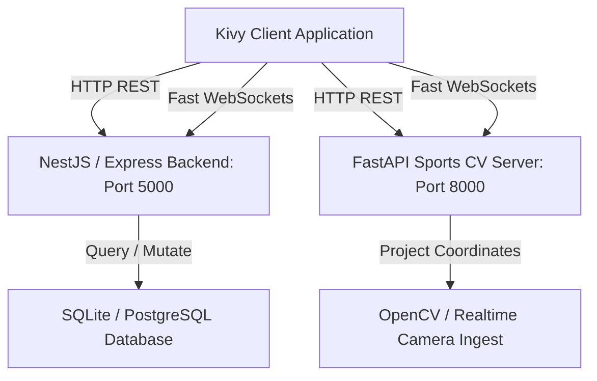
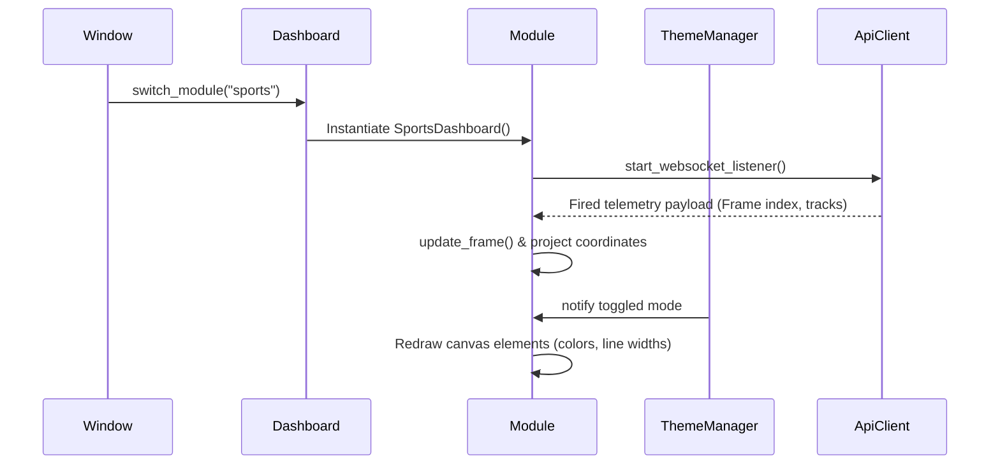

# CAMPUSX OS Kivy Client - Architecture Documentation

This document outlines the software design patterns, layout tree, and system flow of the CAMPUSX OS Python + Kivy native client app.

---

## 1. System Topology

The Kivy app acts as a first-class, cross-platform client for the CAMPUSX OS data mesh. It communicates with the same backend engines as the web platform.

---

## 2. Directory Layout

The codebase has been refactored into a highly modular package:

- **`main.py`**: Entry point bootstrapping the application title, default screen manager, and window width.
- **`api.py`**: Single-instance `ApiClient` managing authentication tokens, request caching, and asynchronous WebSockets listeners.
- **`ui/`**: Layout designs package.
  - **`theme.py`**: Manager defining CSS/Tailwind design tokens for Light/Dark modes.
  - **`components.py`**: Styled Kivy canvas UI components: Rounded cards, form fields, action buttons, dynamic tables, and loading skeletons.
  - **`login.py`**: Secure login controller with Biometrics touch features.
  - **`dashboard.py`**: Base layout shell managing search bars, notification centers, sidebar menus, and sliding AI panels.
  - **`modules/`**: Discrete screens mapping each super-app workspace (ERP, Connect, Chain, Market, Sports, SOC, Storage).

---

## 3. UI Component Lifecycle

