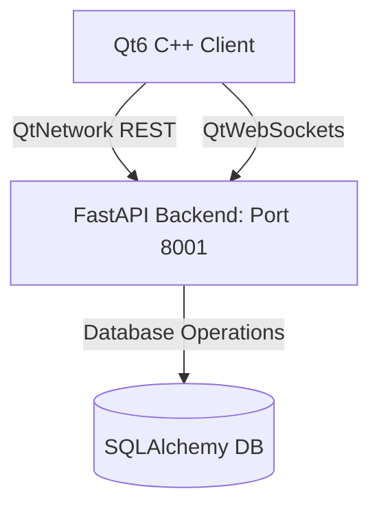
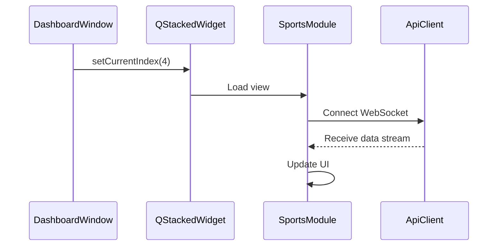

# C++ Architecture Guide

This document outlines the architecture, directory structure, and component flows of the Qt 6 C++ client app.

---

## 1. System Overview

The C++ desktop app communicates with the FastAPI backend using REST and WebSockets:

---

## 2. Directory Structure

- **`CMakeLists.txt`**: Build configuration.
- **`core/`**: Core logic and networking:
  - `CampusXCore`: Plugins, IPC, and configuration settings.
  - `ApiClient`: HTTP client with local SQLite offline caching.
  - `ThemeManager`: Dynamic stylesheet loader.
- **`ui/`**: User interface components:
  - `LoginWindow`: Login and auth UI.
  - `DashboardWindow`: Main window container and navigation router.
- **`ui/modules/`**: Application views (Academics, Connect, Chain, Market, Sports).

---

## 3. Component Lifecycle

